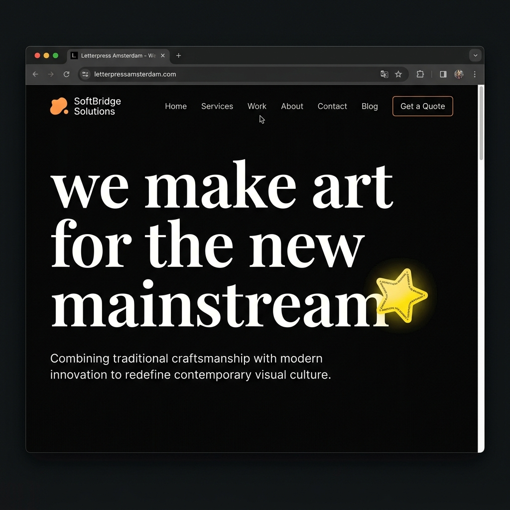
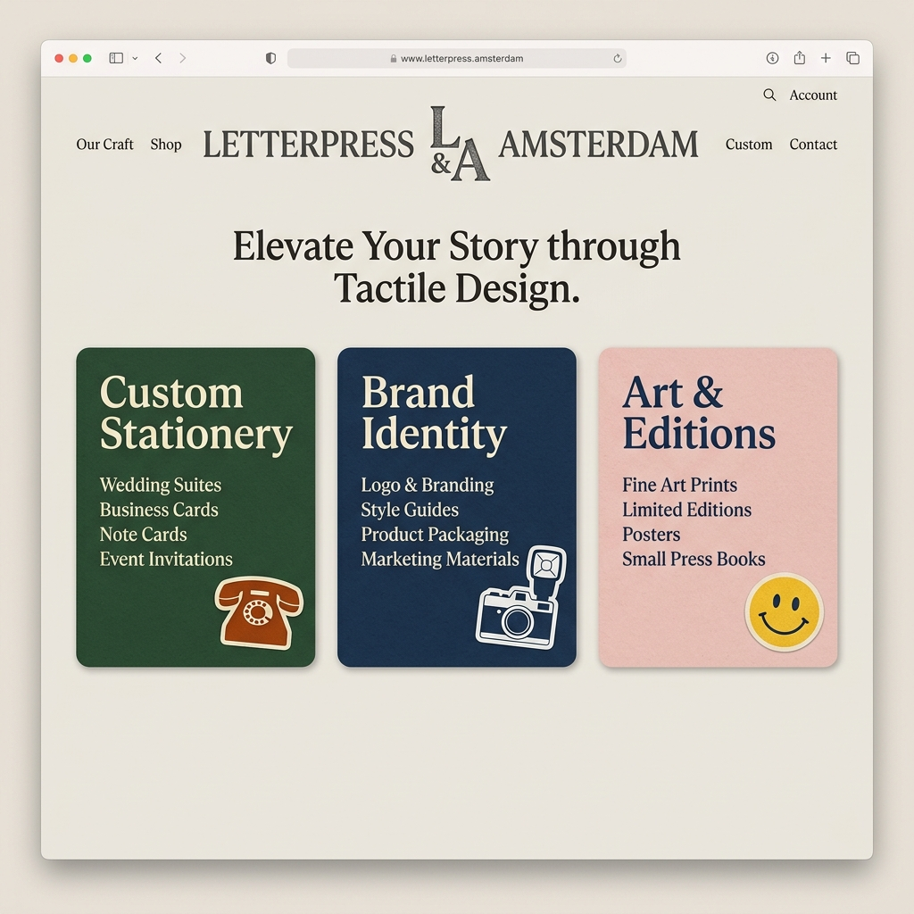
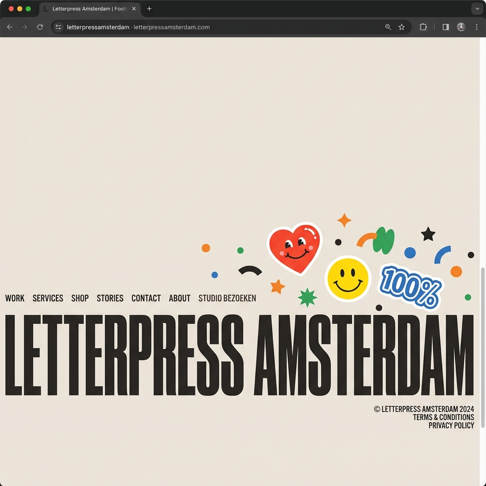

# Letterpress Amsterdam Website
Live https://letterpress-amsterdam-website.vercel.app/
## Project Purpose
This project is a high-fidelity, interactive brand showcase website developed for Letterpress Amsterdam. It is designed to demonstrate premium web aesthetics, luxury brand presentation, and complex user interactions using modern frontend engineering. Built on Next.js 15 and React 19, the codebase transitions a traditional design layout into a highly reactive web application with fluid animations, physics-based micro-interactions, and customized styling structures.

## Screenshots

### Hero Section

### Services Cards

### Footer Section

## Technical Architecture

### Core Framework and Rendering
* Next.js 15: Serves as the primary framework utilizing the App Router architecture for layout management, SEO optimization, and metadata configuration.
* React 19: Provides component-based UI isolation, rendering optimization, and lifecycle hooks matching modern reactivity standards.

### Styling Architecture
* CSS variables: Used to establish a central, maintainable design system tokenized for colors, typography, and viewport transitions.
* Vanilla CSS modular partials: A collection of stylesheet partials imported into a single globals.css entry point, preventing Tailwind dependency and ensuring complete control over layouts and transitions.
* Fully responsive styling: Media query adaptation for mobile, tablet, and desktop layouts.

### Animation and Interaction Engineering
All motion elements and physics simulations are powered by GSAP (GreenSock Animation Platform) in combination with specialized plugins:
* ScrollTrigger: Drives scroll-synchronized transitions, SVG draw-in path animations, and pinned horizontal layouts.
* custom cursor bubble: A dynamic cursor-following blob using GSAP quickTo utilities. It applies spring-based tracking to follow mouse position with ease, altering sizes and text dynamically based on hovered elements.
* elastic card interaction: Service cards spread horizontally on hover with elastic easing. The card hovered scales up while adjacent cards slide away to distribute visual weight.
* horizontal scroll and letter bounce: A pinned viewport section containing letters that scroll horizontally, triggering entry rotations and bouncy scaling as they enter.
* page transition scribble: A full-screen hand-drawn scribble mask svg overlay that draws and erases dynamically on logo click before resetting scroll positions.
* wiggle mechanics: A customized rotation wiggling system triggered on hover states, using configurable rotation thresholds.
* marquee randomization: Double-marquee infinite scrolling lines featuring an algorithm that dynamically shuffles brand logos and background colors, ensuring adjacent duplicate items or colors do not appear at the seams.
* smooth scrolling: Synchronized scroll kinetics utilizing Lenis smooth scrolling.

## Vercel Compatibility
The codebase is optimized for seamless deployment on Vercel:
* Next.js build engine: Out-of-the-box support for Vercel serverless functions, static site generation, and incremental builds.
* zero-config deployment: Package.json and next.config.mjs require no custom environments to run on Vercel; deployment is instantly resolved through the standard Next.js build pipeline.
